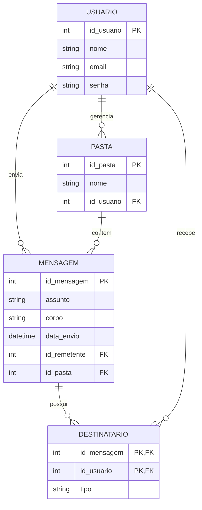

# 📬 Sistema de Serviço de E-mail (Clone Outlook/Gmail)

## 🏛️ Informações Institucionais
* **Instituição:** Universidade do Vale do Itajaí (UNIVALI)
* **Escola:** Escola Politécnica – NEI
* **Disciplina:** Banco de Dados
* **Professor:** Maurício Pasetto de Freitas, MSc.
* **Atividade:** Atividade Avaliativa TRABALHO – M3 (Entrega em Dupla)
* **Autores:** Kauã Maciel Mendes & Gabriel Jacques Martinez

---

## 📌 Sumário
1. [Definição do Problema](#1-definição-do-problema)
2. [Projeto Conceitual (DER)](#2-projeto-conceitual-der)
3. [Projeto Lógico](#3-projeto-lógico)
4. [Projeto Físico (SQL)](#4-projeto-físico-sql)
5. [Implementação CRUD (Python)](#5-implementação-crud-python)

---

## 1. Definição do Problema

O volume crescente de comunicação eletrônica exige plataformas robustas que garantam o envio, recebimento e organização de mensagens de forma segura e eficiente. O problema central que este serviço de e-mail visa resolver é a fragmentação e a dificuldade na gestão de grandes volumes de informações, tanto para uso pessoal quanto corporativo. O público-alvo abrange usuários que necessitam de um ambiente centralizado, ágil e confiável para gerenciar suas comunicações diárias, evitando a perda de contexto e de arquivos importantes.

Para solucionar essa dor, o sistema proposto modela a estrutura fundamental de um serviço de mensageria assíncrona. Através de entidades bem definidas como Usuários, Pastas (para organização estrutural), Mensagens e Destinatários, a plataforma permite a rastreabilidade completa da comunicação. A modelagem garante que o usuário saiba exatamente quem enviou uma mensagem, quem a recebeu, e em qual diretório (como Caixa de Entrada ou Enviados) ela está alocada, assegurando a integridade dos dados e a fluidez do serviço.

---

## 2. Projeto Conceitual (DER)



---

## 3. Projeto Lógico

| Tabela | Atributos e Chaves |
| :--- | :--- |
| **Usuario** | **id_usuario** (PK), nome, email, senha |
| **Pasta** | **id_pasta** (PK), nome, *id_usuario* (FK) |
| **Mensagem** | **id_mensagem** (PK), assunto, corpo, data_envio, *id_remetente* (FK), *id_pasta* (FK) |
| **Destinatario** | ***id_mensagem*** (PK, FK), ***id_usuario*** (PK, FK), tipo |

---

## 4. Projeto Físico (SQL)

Código SQL para a criação do banco de dados, tabelas e inserção inicial de dados.

```sql
-- Cria banco e usa
CREATE DATABASE email_db;
USE email_db;

-- Cria tabelas
CREATE TABLE Usuario (
    id_usuario INT AUTO_INCREMENT PRIMARY KEY,
    nome VARCHAR(100) NOT NULL,
    email VARCHAR(100) UNIQUE NOT NULL,
    senha VARCHAR(255) NOT NULL
);

CREATE TABLE Pasta (
    id_pasta INT AUTO_INCREMENT PRIMARY KEY,
    nome VARCHAR(50) NOT NULL,
    id_usuario INT NOT NULL,
    FOREIGN KEY (id_usuario) REFERENCES Usuario(id_usuario) ON DELETE CASCADE
);

CREATE TABLE Mensagem (
    id_mensagem INT AUTO_INCREMENT PRIMARY KEY,
    assunto VARCHAR(255),
    corpo TEXT,
    data_envio DATETIME DEFAULT CURRENT_TIMESTAMP,
    id_remetente INT NOT NULL,
    id_pasta INT NOT NULL,
    FOREIGN KEY (id_remetente) REFERENCES Usuario(id_usuario),
    FOREIGN KEY (id_pasta) REFERENCES Pasta(id_pasta) ON DELETE CASCADE
);

CREATE TABLE Destinatario (
    id_mensagem INT NOT NULL,
    id_usuario INT NOT NULL,
    tipo VARCHAR(10) NOT NULL,
    PRIMARY KEY (id_mensagem, id_usuario),
    FOREIGN KEY (id_mensagem) REFERENCES Mensagem(id_mensagem) ON DELETE CASCADE,
    FOREIGN KEY (id_usuario) REFERENCES Usuario(id_usuario) ON DELETE CASCADE
);

-- Popula tabelas
INSERT INTO Usuario (nome, email, senha) VALUES 
('Kauã', 'kaua@univali.br', '12345'),
('Professor', 'prof@univali.br', 'abcde');

INSERT INTO Pasta (nome, id_usuario) VALUES 
('Caixa de Entrada', 1),
('Enviados', 1),
('Caixa de Entrada', 2);

INSERT INTO Mensagem (assunto, corpo, id_remetente, id_pasta) VALUES 
('Dúvida Trabalho', 'Professor, segue anexo.', 1, 2),
('Resposta', 'Recebido, Kauã.', 2, 1);

INSERT INTO Destinatario (id_mensagem, id_usuario, tipo) VALUES 
(1, 2, 'PARA'),
(2, 1, 'PARA');
```

---

## 5. Implementação CRUD (Python)

Código para manipulação dos dados via console utilizando Python e conexão direta com o MySQL.

**Requisito:** `pip install mysql-connector-python`

```python
import mysql.connector

# Conexão
db = mysql.connector.connect(
    host="localhost",
    user="root",
    password="",
    database="email_db"
)
cursor = db.cursor()

# -- CRUD Usuario --
def criar_usuario(nome, email, senha):
    cursor.execute("INSERT INTO Usuario (nome, email, senha) VALUES (%s, %s, %s)", (nome, email, senha))
    db.commit()

def ler_usuarios():
    cursor.execute("SELECT * FROM Usuario")
    for row in cursor.fetchall(): print(row)

def atualizar_usuario(id_usuario, novo_nome):
    cursor.execute("UPDATE Usuario SET nome = %s WHERE id_usuario = %s", (novo_nome, id_usuario))
    db.commit()

def deletar_usuario(id_usuario):
    cursor.execute("DELETE FROM Usuario WHERE id_usuario = %s", (id_usuario,))
    db.commit()

# -- CRUD Pasta --
def criar_pasta(nome, id_usuario):
    cursor.execute("INSERT INTO Pasta (nome, id_usuario) VALUES (%s, %s)", (nome, id_usuario))
    db.commit()

def ler_pastas():
    cursor.execute("SELECT * FROM Pasta")
    for row in cursor.fetchall(): print(row)

def atualizar_pasta(id_pasta, novo_nome):
    cursor.execute("UPDATE Pasta SET nome = %s WHERE id_pasta = %s", (novo_nome, id_pasta))
    db.commit()

def deletar_pasta(id_pasta):
    cursor.execute("DELETE FROM Pasta WHERE id_pasta = %s", (id_pasta,))
    db.commit()

# -- CRUD Mensagem --
def criar_mensagem(assunto, corpo, id_remetente, id_pasta):
    cursor.execute("INSERT INTO Mensagem (assunto, corpo, id_remetente, id_pasta) VALUES (%s, %s, %s, %s)", (assunto, corpo, id_remetente, id_pasta))
    db.commit()

def ler_mensagens():
    cursor.execute("SELECT * FROM Mensagem")
    for row in cursor.fetchall(): print(row)

def atualizar_mensagem(id_mensagem, novo_assunto):
    cursor.execute("UPDATE Mensagem SET assunto = %s WHERE id_mensagem = %s", (novo_assunto, id_mensagem))
    db.commit()

def deletar_mensagem(id_mensagem):
    cursor.execute("DELETE FROM Mensagem WHERE id_mensagem = %s", (id_mensagem,))
    db.commit()

# -- Testes --
if __name__ == "__main__":
    ler_usuarios()
    criar_usuario("Novo User", "novo@teste.com", "senha123")
    ler_usuarios()
    cursor.close()
    db.close()
```